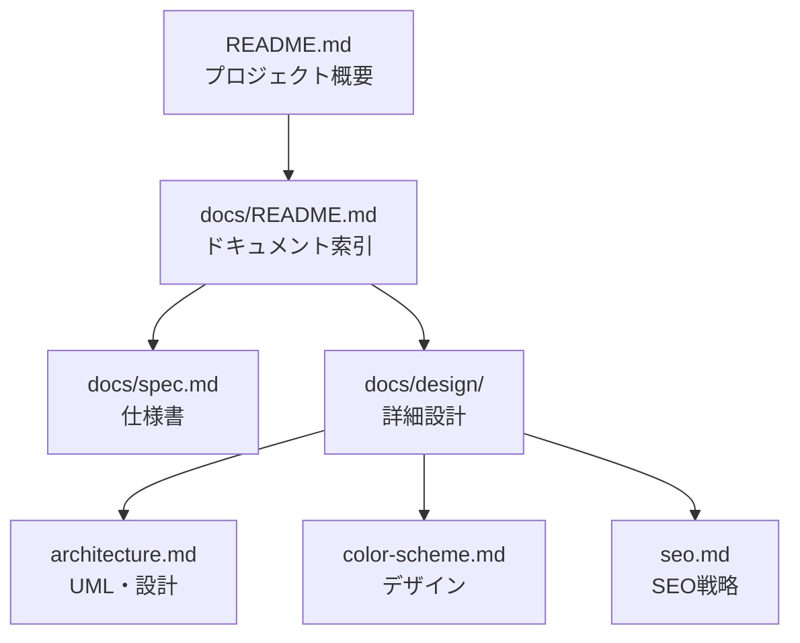

# ドキュメント一覧

> [プロジェクトトップ](../README.md)

リサイズくんプロジェクトのドキュメントへのインデックスです。目的に応じて適切なドキュメントを選択してください。

## 📚 ドキュメント一覧

| ファイル | 目的 | 対象読者 |
|---------|------|---------|
| [`spec.md`](./spec.md) | プロジェクト仕様 | 開発者（必読） |
| [`design/architecture.md`](./design/architecture.md) | 詳細設計・UML | 開発者（詳細理解） |
| [`design/color-scheme.md`](./design/color-scheme.md) | デザインシステム | デザイナー・フロントエンド開発者 |
| [`design/seo.md`](./design/seo.md) | SEO戦略 | マーケター・SEO担当 |

## 🎯 対象読者別ガイド

### 初めての方

1. [プロジェクトトップ](../README.md) - プロジェクト概要を確認
2. [仕様書](./spec.md) - 機能仕様と技術スタックを理解

### 新規開発者

1. [仕様書](./spec.md) - まずは仕様を把握
2. [アーキテクチャ設計](./design/architecture.md) - 詳細設計とUML図を確認
3. [デザインシステム](./design/color-scheme.md) - UI開発時の参照

### デザイナー

- [デザインシステム](./design/color-scheme.md) - カラーパレットとUIガイドライン

### SEO担当・マーケター

- [SEO戦略](./design/seo.md) - SEO施策の詳細

### コントリビューター

1. [仕様書](./spec.md) - プロジェクト仕様を理解
2. [アーキテクチャ設計](./design/architecture.md) - 実装詳細を確認
3. [デザインシステム](./design/color-scheme.md) - UIガイドラインに従う

## 🔍 目的別ガイド

### 機能仕様を知りたい

→ **[仕様書](./spec.md)**
- プロジェクト概要
- 技術スタック
- 主要機能リスト
- GA4トラッキング仕様
- 変更履歴

### アーキテクチャを理解したい

→ **[アーキテクチャ設計](./design/architecture.md)**
- UMLダイアグラム（コンポーネント図、シーケンス図、状態図など）
- データフロー詳細
- テスト戦略
- 非機能要件（パフォーマンス、セキュリティ、アクセシビリティ）
- 実装上の注意点

### デザインを確認したい

→ **[デザインシステム](./design/color-scheme.md)**
- カラーパレット
- カラー使用ガイドライン
- TailwindCSS設定
- コンポーネント別カラー適用
- アクセシビリティ配慮

### SEO施策を確認したい

→ **[SEO戦略](./design/seo.md)**
- 静的・動的メタデータ
- 構造化データ（JSON-LD）
- SEOファイル（robots.txt, sitemap.xml）
- SEO改善履歴
- 期待される効果

### 変更履歴を追いたい

→ **[仕様書](./spec.md)** の変更履歴セクション

## 📊 ドキュメント構造

## 💡 ドキュメントの読み方

1. **概要から入る**: プロジェクトトップのREADMEから始める
2. **仕様を理解**: spec.mdで機能と技術スタックを把握
3. **詳細を深掘り**: design/ディレクトリの該当ドキュメントを参照
4. **実装時**: アーキテクチャ設計とデザインシステムを参照しながら実装

## 📝 ドキュメント更新ポリシー

- **仕様書**: 機能追加・変更の都度更新
- **アーキテクチャ**: 設計変更時のみ更新
- **デザインシステム**: UI変更時のみ更新
- **SEO戦略**: SEO施策変更時のみ更新

## 🔗 関連リンク

- [プロジェクトトップ](../README.md)
- [GitHubリポジトリ](https://github.com/noricha-vr/image-resizer)
- [ライセンス](../LICENSE)

