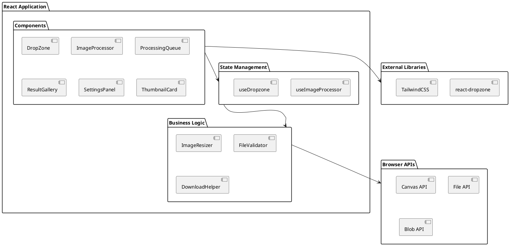
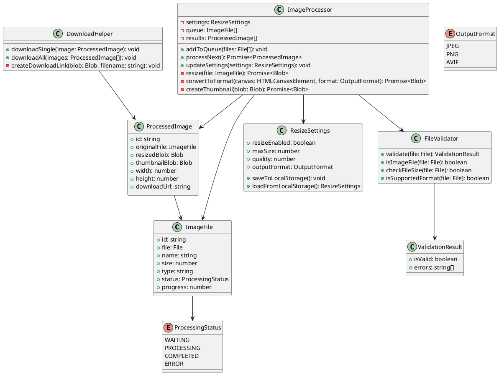

# システムアーキテクチャ設計

> 📑 [ドキュメント一覧に戻る](../README.md) | [プロジェクトトップ](../../README.md)

このドキュメントでは、リサイズくんの詳細なシステムアーキテクチャとUMLダイアグラムを説明します。

## UMLによるシステムアーキテクチャ

### コンポーネント図

```mermaid
graph TB
    subgraph "ブラウザ環境"
        UI[UIレイヤー]
        BL[ビジネスロジック]
        WA[Web APIs]
    end
    
    subgraph "UIレイヤー"
        DZ[DropZone<br/>Component]
        SP[Settings<br/>Panel]
        PQ[Processing<br/>Queue]
        RG[Result<br/>Gallery]
    end
    
    subgraph "ビジネスロジック"
        IP[Image<br/>Processor]
        FV[File<br/>Validator]
        DH[Download<br/>Helper]
    end
    
    subgraph "Web APIs"
        CA[Canvas API]
        FA[File API]
        DA[Download API]
    end
    
    DZ --> IP
    SP --> IP
    IP --> CA
    IP --> FV
    FV --> FA
    RG --> DH
    DH --> DA
    IP --> PQ
    IP --> RG
```



### パッケージ図



## UMLによるデータフロー

### アクティビティ図

```mermaid
graph TD
    Start([開始]) --> DragDrop[ファイルをドラッグ&ドロップ]
    DragDrop --> Validate{ファイル検証}
    
    Validate -->|有効| AddQueue[処理キューに追加]
    Validate -->|無効| ShowError[エラー表示]
    ShowError --> DragDrop
    
    AddQueue --> ProcessNext[次のファイルを処理]
    ProcessNext --> LoadImage[画像を読み込み]
    LoadImage --> CalculateSize[リサイズサイズ計算]
    CalculateSize --> ResizeCanvas[Canvas APIでリサイズ]
    ResizeCanvas --> CreateThumbnail[サムネイル生成]
    CreateThumbnail --> StoreResult[結果を保存]
    StoreResult --> DisplayResult[結果を表示]
    
    DisplayResult --> MoreFiles{他にファイルあり？}
    MoreFiles -->|はい| ProcessNext
    MoreFiles -->|いいえ| Complete[処理完了]
    
    Complete --> WaitDownload[ダウンロード待機]
    WaitDownload --> Download[ダウンロード実行]
    Download --> End([終了])
```



## UMLクラス図



## 動的振る舞い

### シーケンス図（画像処理フロー）

```mermaid
sequenceDiagram
    participant User
    participant DropZone
    participant FileValidator
    participant ImageProcessor
    participant Canvas
    participant LocalStorage
    participant ResultGallery
    
    User->>DropZone: ファイルをドロップ
    DropZone->>FileValidator: ファイル検証
    FileValidator-->>DropZone: 検証結果
    
    alt 検証成功
        DropZone->>ImageProcessor: ファイル追加
        ImageProcessor->>LocalStorage: 設定読み込み
        LocalStorage-->>ImageProcessor: サイズ・品質設定
        ImageProcessor->>ImageProcessor: キューに追加
        
        loop 各ファイルごと
            ImageProcessor->>Canvas: 画像読み込み
            Canvas-->>ImageProcessor: 画像データ
            ImageProcessor->>Canvas: リサイズ処理
            Canvas-->>ImageProcessor: リサイズ済みCanvas
            ImageProcessor->>Canvas: 形式変換（JPEG/PNG/AVIF、品質指定）
            Canvas-->>ImageProcessor: 変換済みBlob
            ImageProcessor->>Canvas: サムネイル生成
            Canvas-->>ImageProcessor: サムネイルBlob
            ImageProcessor->>ResultGallery: 結果追加
            ResultGallery->>User: サムネイル表示
        end
    else 検証失敗
        DropZone->>User: エラー表示
    end
    
    User->>ResultGallery: ダウンロードクリック
    ResultGallery->>User: 選択形式ファイルダウンロード
```



### 状態図

```plantuml
@startuml
[*] --> Idle : アプリ起動

Idle --> DragOver : ファイルドラッグ開始
DragOver --> Idle : ドラッグキャンセル
DragOver --> Processing : ファイルドロップ

Processing --> Processing : ファイル処理中
Processing --> DisplayResults : 処理完了
Processing --> Error : エラー発生

Error --> Idle : エラー確認

DisplayResults --> Downloading : ダウンロード開始
Downloading --> DisplayResults : ダウンロード完了
DisplayResults --> Idle : リセット

Idle --> [*] : アプリ終了
@enduml
```



### ユースケース図

```plantuml
@startuml
actor ユーザー as User

rectangle "画像リサイズシステム" {
    usecase "画像をアップロード" as UC1
    usecase "ドラッグ&ドロップ" as UC1_1
    usecase "ファイル選択" as UC1_2
    
    usecase "リサイズ設定変更" as UC2
    usecase "リサイズON/OFF切り替え" as UC2_0
    usecase "最大サイズ指定" as UC2_1
    usecase "品質設定" as UC2_2
    
    usecase "画像処理状況確認" as UC3
    usecase "プログレス表示" as UC3_1
    usecase "エラー確認" as UC3_2
    
    usecase "結果をダウンロード" as UC4
    usecase "個別ダウンロード" as UC4_1
    usecase "一括ダウンロード" as UC4_2
    
    usecase "処理をリセット" as UC5
}

User --> UC1
UC1 <|-- UC1_1
UC1 <|-- UC1_2

User --> UC2
UC2 <|-- UC2_0
UC2 <|-- UC2_1
UC2 <|-- UC2_2

User --> UC3
UC3 <|-- UC3_1
UC3 <|-- UC3_2

User --> UC4
UC4 <|-- UC4_1
UC4 <|-- UC4_2

User --> UC5
@enduml
```

## ウェブサイト構造

### サイトマップ

```yaml
sitemap:
  - path: /
    title: "リサイズくん - 画像リサイズ・圧縮ツール【無料・サーバーアップロード不要】"
    type: "Home Page"
    sections:
      - id: "header"
        components: ["Logo", "Navigation (Privacy, Terms)"]
      - id: "main"
        components: ["H1 Title", "Description", "DropZone", "SettingsPanel", "ProcessingStatus"]
      - id: "footer"
        components: ["Copyright", "GitHub Link", "Privacy Policy", "Terms"]

  - path: /privacy
    title: "プライバシーポリシー | リサイズくん"
    type: "Legal Page"

  - path: /terms
    title: "利用規約 | リサイズくん"
    type: "Legal Page"
```

### ページレイアウト構造

```mermaid
graph TD
    subgraph "メインページ (100vh)"
        Header["ヘッダー (60px)<br/>・ロゴ<br/>・設定ボタン"]
        
        subgraph "コンテンツエリア (calc(100vh - 120px))"
            subgraph "アップロードエリア (40%)"
                DropZone["ドロップゾーン<br/>・ドラッグ&ドロップエリア<br/>・ファイル選択ボタン<br/>・使用方法テキスト"]
                Settings["設定パネル<br/>・最大サイズ入力(デフォルト720px)<br/>・品質スライダー(50-100%)<br/>・出力形式選択(JPEG/PNG/AVIF)<br/>・設定保存(localStorage)"]
            end
            
            subgraph "処理状況エリア (20%)"
                Queue["処理キュー<br/>・待機中ファイルリスト<br/>・プログレスバー"]
            end
            
            subgraph "結果表示エリア (40%)"
                Gallery["結果ギャラリー<br/>・サムネイルグリッド<br/>・ダウンロードボタン<br/>・形式アイコン表示"]
            end
        end
        
        Footer["フッター (60px)<br/>・コピーライト<br/>・Chrome推奨表示"]
    end
```



### レスポンシブデザイン考慮点

```yaml
responsive_design:
  breakpoints:
    mobile: "max-width: 640px"
    tablet: "max-width: 1024px"
    desktop: "min-width: 1025px"
    
  layout_changes:
    mobile:
      - グリッドを1カラムに変更
      - サムネイルサイズを100pxに縮小
      - 設定パネルをモーダル化
    tablet:
      - グリッドを2カラムに調整
      - サイドバー設定を折りたたみ可能に
    desktop:
      - フルグリッドレイアウト
      - すべての要素を常時表示
```

## インフラストラクチャ構成

### デプロイメントアーキテクチャ

```mermaid
graph LR
    subgraph "開発環境"
        Dev[開発者] --> Git[GitHub Repository]
    end
    
    subgraph "CI/CD"
        Git --> GHA[GitHub Actions]
        GHA --> Build[ビルドプロセス]
        Build --> Test[テスト実行]
    end
    
    subgraph "Cloudflare"
        Test --> CFP[Cloudflare Pages]
        CFP --> CDN[Cloudflare CDN]
        CDN --> Edge[Edge Network]
    end
    
    subgraph "エンドユーザー"
        Edge --> Browser[ブラウザ]
    end
```



### Cloudflare Pages設定

```yaml
cloudflare_pages:
  build_settings:
    build_command: "npm run build"
    output_directory: "dist"
    root_directory: "/"
    
  environment_variables:
    NODE_VERSION: "22"
    
  deployment:
    production_branch: "main"
    preview_branches: ["develop", "feature/*"]
    
  optimization:
    - Auto Minify (HTML, CSS, JS)
    - Brotli圧縮
    - HTTP/3サポート
    
  headers:
    - path: "/*"
      headers:
        X-Frame-Options: "DENY"
        X-Content-Type-Options: "nosniff"
        Referrer-Policy: "strict-origin-when-cross-origin"
```

## テスト戦略と項目

### テスト戦略

```yaml
test_strategy:
  pyramid:
    unit_tests: 60%
    integration_tests: 30%
    e2e_tests: 10%
    
  coverage_target: 80%
  
  automation:
    - 単体テスト: 完全自動化
    - 統合テスト: 完全自動化
    - E2Eテスト: 主要フロー自動化
    - 手動テスト: ブラウザ互換性、UX確認
```

### 単体テスト項目

```yaml
unit_tests:
  imageResizer:
    - アスペクト比維持の計算ロジック
    - 最大サイズ制限の適用（720px）
    - JPEG/PNG/AVIF変換処理
    - 品質設定（50-100%）の適用
    - 形式別のオプション処理
    - エラーハンドリング
    
  fileValidator:
    - 有効な画像形式の判定（JPEG、PNG、WebP）
    - ファイルサイズ制限
    - MIMEタイプ検証
    - 拡張子チェック
    
  downloadHelper:
    - Blob生成（選択形式）
    - ファイル名生成（形式に応じた拡張子）
    - ダウンロードリンク作成
    
  localStorage:
    - 設定の保存処理
    - 設定の読み込み処理
    - デフォルト値へのフォールバック
```

### 統合テスト項目

```yaml
integration_tests:
  file_processing_flow:
    - ファイルアップロード → 検証 → 処理
    - 複数ファイルの順次処理
    - エラー時のキュー管理
    
  ui_interaction:
    - ドラッグ&ドロップ動作
    - 設定変更の反映
    - 結果表示の更新
```

### E2Eテスト項目

```yaml
e2e_tests:
  critical_path:
    - 単一画像のアップロード → リサイズ → ダウンロード
    - 複数画像の一括処理
    - 設定変更後の処理
    - localStorage保存と読み込み
    
  browser_compatibility:
    - Chrome最新版のみ
```

### 非機能テスト項目

```yaml
performance_tests:
  metrics:
    - 初回ロード: < 2秒
    - 画像処理時間: < 1秒/画像（2MB以下）
    - メモリ使用量: < 500MB
    
accessibility_tests:
  wcag_compliance:
    - キーボード操作対応
    - スクリーンリーダー対応
    - カラーコントラスト基準
    - フォーカス表示
    
security_tests:
  client_side:
    - XSS脆弱性チェック
    - ファイルアップロード検証
    - Content Security Policy
```

## 非機能要件への対応

### パフォーマンス最適化

```yaml
performance_optimization:
  image_processing:
    - Web Workerでのバックグラウンド処理
    - 段階的な品質調整
    - メモリ効率的なストリーミング処理
    
  ui_responsiveness:
    - 仮想スクロールによる大量サムネイル表示
    - 遅延ローディング
    - デバウンス処理
    
  bundle_optimization:
    - コード分割
    - Tree Shaking
    - 動的インポート
```

### セキュリティ対策

```yaml
security_measures:
  client_side_validation:
    - ファイルタイプ検証
    - サイズ制限
    - 悪意のあるコンテンツチェック
    
  privacy_protection:
    - クライアント完結処理
    - データの非永続化
    - セッション終了時の自動クリア
    
  csp_headers:
    default-src: "'self'"
    script-src: "'self' 'unsafe-inline'"
    style-src: "'self' 'unsafe-inline'"
    img-src: "'self' data: blob:"
```

### アクセシビリティ

```yaml
accessibility_features:
  keyboard_navigation:
    - Tab順序の適切な設定
    - Enterキーでのファイル選択
    - Escapeキーでのモーダルクローズ
    
  screen_reader:
    - 適切なARIA属性
    - 処理状況のライブリージョン
    - 画像の代替テキスト
    
  visual_design:
    - 高コントラストモード対応
    - フォーカスインジケーター
    - エラーメッセージの明確化
```

## 実装上の注意点

### 画像処理の最適化

```yaml
image_processing_tips:
  memory_management:
    - 大きな画像は分割処理
    - 処理済み画像の適切な破棄
    - URLオブジェクトのrevoke

  quality_settings:
    - JPEG品質: デフォルト80%（50-100%）
    - PNG: 可逆圧縮（品質設定なし）
    - AVIF品質: デフォルト80%（50-100%）
    - デフォルト出力形式: JPEG

  canvas_handling:
    - OffscreenCanvasの活用
    - ImageBitmapの使用
    - 形式別変換: toBlob(mimeType, quality)

  localStorage_management:
    - 設定保存キー: 'imageResizerSettings'
    - リサイズ有効/無効: デフォルトtrue（ON）
    - 最大サイズ: デフォルト720px（リサイズON時のみ使用）
    - 品質設定: デフォルト80%
    - 出力形式: デフォルトJPEG
```

### エラーハンドリング

```yaml
error_handling:
  user_errors:
    - 非画像ファイル: "画像ファイルを選択してください"
    - サイズ超過: "ファイルサイズが大きすぎます（最大50MB）"
    - 処理失敗: "画像の処理に失敗しました"
    
  system_errors:
    - メモリ不足: 処理を分割または中断
    - ブラウザ非対応: 代替手段の提示
    
  recovery_strategy:
    - 失敗したファイルをスキップ
    - 部分的な結果を保持
    - リトライオプション提供
```

### UX考慮事項

```yaml
ux_considerations:
  feedback:
    - 処理中のプログレスバー表示
    - 完了時の通知
    - エラー時の具体的な対処法
    - 形式別アイコン表示

  defaults:
    - 最大サイズ: 720px
    - 品質: 80%
    - 出力形式: JPEG（選択可能）
    - 設定はlocalStorageに自動保存

  simplicity:
    - 最小限の設定項目
    - 直感的なドラッグ&ドロップ
    - ワンクリックダウンロード
    - 品質スライダー（50-100%）
    - 形式選択ボタン（JPEG/PNG/AVIF）
```

## 付録

### 用語集

```yaml
glossary:
  - Canvas API: ブラウザ上で画像処理を行うためのAPI
  - Blob: Binary Large Objectの略、ファイルデータを扱うオブジェクト
  - Web Worker: バックグラウンドでJavaScriptを実行する仕組み
  - CSP: Content Security Policy、XSS攻撃を防ぐセキュリティ機能
  - WCAG: Web Content Accessibility Guidelines、アクセシビリティ基準
```

### 参考資料

```yaml
references:
  documentation:
    - MDN Web Docs - Canvas API
    - React Documentation
    - Cloudflare Pages Documentation
    
  libraries:
    - react-dropzone GitHub
    - TailwindCSS Documentation
    - Vite Guide
    
  standards:
    - WCAG 2.1 Guidelines
    - Web Image Formats Guide
```

### 今後の拡張案

```yaml
future_enhancements:
  features:
    - バッチ処理の並列化
    - 画像フォーマット変換機能
    - 基本的な画像編集機能（回転、切り抜き）
    - プリセット保存機能
    
  technical:
    - WebAssemblyによる高速化
    - Service Workerでオフライン対応
    - PWA化
    
  business:
    - 使用統計の収集（プライバシー配慮）
    - 多言語対応
    - ダークモード対応
```

### 実装の重要ポイント

```yaml
format_conversion:
  canvas_api:
    jpeg:
      mimeType: "image/jpeg"
      quality_range: "0.5 - 1.0"  # 50% - 100%
      extension: ".jpg"
    png:
      mimeType: "image/png"
      quality: null  # PNGは可逆圧縮
      extension: ".png"
    avif:
      mimeType: "image/avif"
      quality_range: "0.5 - 1.0"  # 50% - 100%
      extension: ".avif"
    example: |
      const convertImage = async (canvas, format, quality) => {
        const mimeType = {
          'JPEG': 'image/jpeg',
          'PNG': 'image/png',
          'AVIF': 'image/avif'
        }[format];

        const qualityValue = format === 'PNG' ? undefined : quality / 100;

        return new Promise((resolve) => {
          canvas.toBlob(
            (blob) => resolve(blob),
            mimeType,
            qualityValue
          );
        });
      };

  file_naming:
    pattern: "filename_720px.[ext]"
    extensions:
      JPEG: ".jpg"
      PNG: ".png"
      AVIF: ".avif"

  localStorage_structure:
    key: "imageResizerSettings"
    data:
      resizeEnabled: true  # リサイズON/OFF（デフォルトtrue）
      maxSize: 720  # 最大サイズ（リサイズON時のみ使用）
      quality: 80  # パーセント値で保存
      outputFormat: "JPEG"  # デフォルト
    example: |
      const defaultSettings = {
        resizeEnabled: true,
        maxSize: 720,
        quality: 80,
        outputFormat: 'JPEG'
      };
      const saveSettings = (settings) => {
        localStorage.setItem('imageResizerSettings', JSON.stringify(settings));
      };
      const loadSettings = () => {
        const saved = localStorage.getItem('imageResizerSettings');
        return saved ? JSON.parse(saved) : defaultSettings;
      };
      
  chrome_only_features:
    - OffscreenCanvas対応
    - ImageBitmap API
    - 高速なCanvas処理
    - ドラッグ&ドロップの安定動作
    
  resize_calculation:
    maintain_aspect_ratio: true
    example: |
      const aspectRatio = originalWidth / originalHeight;
      let newWidth = originalWidth;
      let newHeight = originalHeight;
      
      if (originalWidth > maxSize || originalHeight > maxSize) {
        if (aspectRatio > 1) {
          newWidth = maxSize;
          newHeight = maxSize / aspectRatio;
        } else {
          newHeight = maxSize;
          newWidth = maxSize * aspectRatio;
        }
      }
```

