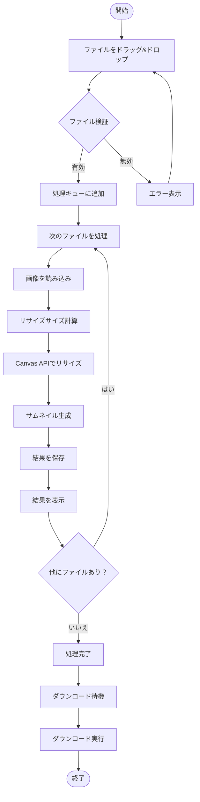

# 画像リサイズサービス設計書

## 1. プロジェクト概要

### 1.1 プロジェクト基本情報

```yaml
project:
  name: "Image Resizer"
  version: "1.0.0"
  type: "Single Page Application"
  description: "ドラッグ&ドロップで簡単に画像をJPEG/PNG/AVIF形式にリサイズできるウェブサービス"

requirements:
  functional:
    - ドラッグ&ドロップによる画像アップロード
    - アスペクト比を維持した画像リサイズ（最大720px）
    - JPEG/PNG/AVIF形式への変換対応
    - 複数ファイルの順次処理
    - サムネイル表示とダウンロード機能
    - 設定のlocalStorage保存
  non_functional:
    - Chrome専用対応
    - シンプルで直感的なUI
    - 高速な処理速度
    - ブラウザ内完結（サーバー不要）
    - プライバシー保護（画像のサーバー送信なし）
```

### 1.2 主要機能

- **画像アップロード**: ドラッグ&ドロップまたはクリックでファイル選択
- **リサイズ処理**: Canvas APIを使用したクライアントサイドリサイズ（JPEG/PNG/AVIF選択可能）
- **プレビュー表示**: 150pxサムネイルによる処理結果確認
- **ダウンロード**: 個別ダウンロードまたは一括ダウンロード
- **サイズ設定**: 最大サイズの変更機能（デフォルト720px、localStorage保存）
- **品質設定**: 50-100%のスライダー調整（デフォルト80%）
- **出力形式選択**: JPEG/PNG/AVIF から選択可能（デフォルトJPEG）

## 2. 技術スタック概要

```yaml
frontend:
  language: TypeScript
  framework: React 18
  build_tool: Vite
  styling: TailwindCSS
  browser_support: Chrome最新版のみ
  
deployment:
  platform: Cloudflare Pages
  cdn: Cloudflare CDN
  
libraries:
  - react-dropzone: "ドラッグ&ドロップ機能"
  
development:
  package_manager: npm
  linter: ESLint
  formatter: Prettier
```

### 2.1 技術選定理由

- **React + Vite**: 高速なビルドとHMR、シンプルな設定
- **TypeScript**: 型安全性による開発効率向上
- **TailwindCSS**: ユーティリティファーストによる迅速なUI開発
- **Cloudflare Pages**: 無料枠が充実、高速なCDN、簡単なデプロイ
- **Chrome専用**: 最新のWeb APIを活用し、開発・テストを効率化

## 3. ディレクトリ構造

```tree
image-resizer/
├── src/
│   ├── components/
│   │   ├── DropZone.tsx          # ドラッグ&ドロップエリア
│   │   ├── ImageProcessor.tsx    # 画像処理コンポーネント
│   │   ├── ProcessingQueue.tsx   # 処理キュー表示
│   │   ├── ResultGallery.tsx     # 処理結果ギャラリー
│   │   ├── SettingsPanel.tsx     # サイズ・形式設定パネル
│   │   └── ThumbnailCard.tsx     # サムネイル表示カード
│   ├── hooks/
│   │   ├── useImageProcessor.ts  # 画像処理カスタムフック
│   │   ├── useDropzone.ts        # ドロップゾーンフック
│   │   └── useLocalStorage.ts    # localStorage管理フック
│   ├── utils/
│   │   ├── imageResizer.ts       # リサイズ処理ロジック
│   │   ├── fileValidator.ts      # ファイル検証
│   │   ├── downloadHelper.ts     # ダウンロード処理
│   │   └── storageHelper.ts      # localStorage管理
│   ├── types/
│   │   └── index.ts              # TypeScript型定義
│   ├── styles/
│   │   └── globals.css           # グローバルスタイル
│   ├── App.tsx                   # メインアプリコンポーネント
│   └── main.tsx                  # エントリーポイント
├── public/
│   └── favicon.ico               # ファビコン
├── tests/
│   ├── unit/                     # 単体テスト
│   └── e2e/                      # E2Eテスト
├── .github/
│   └── workflows/
│       └── deploy.yml            # CI/CDワークフロー
├── package.json                  # パッケージ定義
├── tsconfig.json                 # TypeScript設定
├── vite.config.ts               # Vite設定
├── tailwind.config.js           # TailwindCSS設定
├── postcss.config.js            # PostCSS設定
├── .eslintrc.json              # ESLint設定
├── .prettierrc                  # Prettier設定
└── README.md                    # プロジェクト説明
```

## 4. UMLによるシステムアーキテクチャ

### 4.1 コンポーネント図


### 4.2 パッケージ図


## 5. UMLによるデータフロー

### 5.1 アクティビティ図



## 6. UMLクラス図


## 7. 動的振る舞い

### 7.1 シーケンス図（画像処理フロー）


### 7.2 状態図


### 7.3 ユースケース図


## 8. ウェブサイト構造

### 8.1 サイトマップ

```yaml
sitemap:
  - path: /
    title: "Image Resizer - 画像リサイズツール"
    type: "Single Page Application"
    sections:
      - id: "header"
        components: ["Logo", "Settings Button"]
      - id: "main"
        components: ["DropZone", "ProcessingQueue", "ResultGallery"]
      - id: "footer"
        components: ["Copyright", "Privacy Policy Link"]
```

### 8.2 ページレイアウト構造


### 8.3 レスポンシブデザイン考慮点

```yaml
responsive_design:
  breakpoints:
    mobile: "max-width: 640px"
    tablet: "max-width: 1024px"
    desktop: "min-width: 1025px"
    
  layout_changes:
    mobile:
      - グリッドを1カラムに変更
      - サムネイルサイズを100pxに縮小
      - 設定パネルをモーダル化
    tablet:
      - グリッドを2カラムに調整
      - サイドバー設定を折りたたみ可能に
    desktop:
      - フルグリッドレイアウト
      - すべての要素を常時表示
```

## 9. インフラストラクチャ構成

### 9.1 デプロイメントアーキテクチャ


### 9.2 Cloudflare Pages設定

```yaml
cloudflare_pages:
  build_settings:
    build_command: "npm run build"
    output_directory: "dist"
    root_directory: "/"
    
  environment_variables:
    NODE_VERSION: "22"
    
  deployment:
    production_branch: "main"
    preview_branches: ["develop", "feature/*"]
    
  optimization:
    - Auto Minify (HTML, CSS, JS)
    - Brotli圧縮
    - HTTP/3サポート
    
  headers:
    - path: "/*"
      headers:
        X-Frame-Options: "DENY"
        X-Content-Type-Options: "nosniff"
        Referrer-Policy: "strict-origin-when-cross-origin"
```

## 10. テスト戦略と項目

### 10.1 テスト戦略

```yaml
test_strategy:
  pyramid:
    unit_tests: 60%
    integration_tests: 30%
    e2e_tests: 10%
    
  coverage_target: 80%
  
  automation:
    - 単体テスト: 完全自動化
    - 統合テスト: 完全自動化
    - E2Eテスト: 主要フロー自動化
    - 手動テスト: ブラウザ互換性、UX確認
```

### 10.2 単体テスト項目

```yaml
unit_tests:
  imageResizer:
    - アスペクト比維持の計算ロジック
    - 最大サイズ制限の適用（720px）
    - JPEG/PNG/AVIF変換処理
    - 品質設定（50-100%）の適用
    - 形式別のオプション処理
    - エラーハンドリング
    
  fileValidator:
    - 有効な画像形式の判定（JPEG、PNG、WebP）
    - ファイルサイズ制限
    - MIMEタイプ検証
    - 拡張子チェック
    
  downloadHelper:
    - Blob生成（選択形式）
    - ファイル名生成（形式に応じた拡張子）
    - ダウンロードリンク作成
    
  localStorage:
    - 設定の保存処理
    - 設定の読み込み処理
    - デフォルト値へのフォールバック
```

### 10.3 統合テスト項目

```yaml
integration_tests:
  file_processing_flow:
    - ファイルアップロード → 検証 → 処理
    - 複数ファイルの順次処理
    - エラー時のキュー管理
    
  ui_interaction:
    - ドラッグ&ドロップ動作
    - 設定変更の反映
    - 結果表示の更新
```

### 10.4 E2Eテスト項目

```yaml
e2e_tests:
  critical_path:
    - 単一画像のアップロード → リサイズ → ダウンロード
    - 複数画像の一括処理
    - 設定変更後の処理
    - localStorage保存と読み込み
    
  browser_compatibility:
    - Chrome最新版のみ
```

### 10.5 非機能テスト項目

```yaml
performance_tests:
  metrics:
    - 初回ロード: < 2秒
    - 画像処理時間: < 1秒/画像（2MB以下）
    - メモリ使用量: < 500MB
    
accessibility_tests:
  wcag_compliance:
    - キーボード操作対応
    - スクリーンリーダー対応
    - カラーコントラスト基準
    - フォーカス表示
    
security_tests:
  client_side:
    - XSS脆弱性チェック
    - ファイルアップロード検証
    - Content Security Policy
```

## 11. 非機能要件への対応

### 11.1 パフォーマンス最適化

```yaml
performance_optimization:
  image_processing:
    - Web Workerでのバックグラウンド処理
    - 段階的な品質調整
    - メモリ効率的なストリーミング処理
    
  ui_responsiveness:
    - 仮想スクロールによる大量サムネイル表示
    - 遅延ローディング
    - デバウンス処理
    
  bundle_optimization:
    - コード分割
    - Tree Shaking
    - 動的インポート
```

### 11.2 セキュリティ対策

```yaml
security_measures:
  client_side_validation:
    - ファイルタイプ検証
    - サイズ制限
    - 悪意のあるコンテンツチェック
    
  privacy_protection:
    - クライアント完結処理
    - データの非永続化
    - セッション終了時の自動クリア
    
  csp_headers:
    default-src: "'self'"
    script-src: "'self' 'unsafe-inline'"
    style-src: "'self' 'unsafe-inline'"
    img-src: "'self' data: blob:"
```

### 11.3 アクセシビリティ

```yaml
accessibility_features:
  keyboard_navigation:
    - Tab順序の適切な設定
    - Enterキーでのファイル選択
    - Escapeキーでのモーダルクローズ
    
  screen_reader:
    - 適切なARIA属性
    - 処理状況のライブリージョン
    - 画像の代替テキスト
    
  visual_design:
    - 高コントラストモード対応
    - フォーカスインジケーター
    - エラーメッセージの明確化
```

## 12. 実装上の注意点

### 12.1 画像処理の最適化

```yaml
image_processing_tips:
  memory_management:
    - 大きな画像は分割処理
    - 処理済み画像の適切な破棄
    - URLオブジェクトのrevoke

  quality_settings:
    - JPEG品質: デフォルト80%（50-100%）
    - PNG: 可逆圧縮（品質設定なし）
    - AVIF品質: デフォルト80%（50-100%）
    - デフォルト出力形式: JPEG

  canvas_handling:
    - OffscreenCanvasの活用
    - ImageBitmapの使用
    - 形式別変換: toBlob(mimeType, quality)

  localStorage_management:
    - 設定保存キー: 'imageResizerSettings'
    - 最大サイズ: デフォルト720px
    - 品質設定: デフォルト80%
    - 出力形式: デフォルトJPEG
```

### 12.2 エラーハンドリング

```yaml
error_handling:
  user_errors:
    - 非画像ファイル: "画像ファイルを選択してください"
    - サイズ超過: "ファイルサイズが大きすぎます（最大10MB）"
    - 処理失敗: "画像の処理に失敗しました"
    
  system_errors:
    - メモリ不足: 処理を分割または中断
    - ブラウザ非対応: 代替手段の提示
    
  recovery_strategy:
    - 失敗したファイルをスキップ
    - 部分的な結果を保持
    - リトライオプション提供
```

### 12.3 UX考慮事項

```yaml
ux_considerations:
  feedback:
    - 処理中のプログレスバー表示
    - 完了時の通知
    - エラー時の具体的な対処法
    - 形式別アイコン表示

  defaults:
    - 最大サイズ: 720px
    - 品質: 80%
    - 出力形式: JPEG（選択可能）
    - 設定はlocalStorageに自動保存

  simplicity:
    - 最小限の設定項目
    - 直感的なドラッグ&ドロップ
    - ワンクリックダウンロード
    - 品質スライダー（50-100%）
    - 形式選択ボタン（JPEG/PNG/AVIF）
```

## 13. 付録

### 13.1 用語集

```yaml
glossary:
  - Canvas API: ブラウザ上で画像処理を行うためのAPI
  - Blob: Binary Large Objectの略、ファイルデータを扱うオブジェクト
  - Web Worker: バックグラウンドでJavaScriptを実行する仕組み
  - CSP: Content Security Policy、XSS攻撃を防ぐセキュリティ機能
  - WCAG: Web Content Accessibility Guidelines、アクセシビリティ基準
```

### 13.2 参考資料

```yaml
references:
  documentation:
    - MDN Web Docs - Canvas API
    - React Documentation
    - Cloudflare Pages Documentation
    
  libraries:
    - react-dropzone GitHub
    - TailwindCSS Documentation
    - Vite Guide
    
  standards:
    - WCAG 2.1 Guidelines
    - Web Image Formats Guide
```

### 13.3 今後の拡張案

```yaml
future_enhancements:
  features:
    - バッチ処理の並列化
    - 画像フォーマット変換機能
    - 基本的な画像編集機能（回転、切り抜き）
    - プリセット保存機能
    
  technical:
    - WebAssemblyによる高速化
    - Service Workerでオフライン対応
    - PWA化
    
  business:
    - 使用統計の収集（プライバシー配慮）
    - 多言語対応
    - ダークモード対応
```

## 13.4 実装の重要ポイント

```yaml
format_conversion:
  canvas_api:
    jpeg:
      mimeType: "image/jpeg"
      quality_range: "0.5 - 1.0"  # 50% - 100%
      extension: ".jpg"
    png:
      mimeType: "image/png"
      quality: null  # PNGは可逆圧縮
      extension: ".png"
    avif:
      mimeType: "image/avif"
      quality_range: "0.5 - 1.0"  # 50% - 100%
      extension: ".avif"
    example: |
      const convertImage = async (canvas, format, quality) => {
        const mimeType = {
          'JPEG': 'image/jpeg',
          'PNG': 'image/png',
          'AVIF': 'image/avif'
        }[format];

        const qualityValue = format === 'PNG' ? undefined : quality / 100;

        return new Promise((resolve) => {
          canvas.toBlob(
            (blob) => resolve(blob),
            mimeType,
            qualityValue
          );
        });
      };

  file_naming:
    pattern: "filename_720px.[ext]"
    extensions:
      JPEG: ".jpg"
      PNG: ".png"
      AVIF: ".avif"

  localStorage_structure:
    key: "imageResizerSettings"
    data:
      maxSize: 720
      quality: 80  # パーセント値で保存
      outputFormat: "JPEG"  # デフォルト
    example: |
      const defaultSettings = {
        maxSize: 720,
        quality: 80,
        outputFormat: 'JPEG'
      };
      const saveSettings = (settings) => {
        localStorage.setItem('imageResizerSettings', JSON.stringify(settings));
      };
      const loadSettings = () => {
        const saved = localStorage.getItem('imageResizerSettings');
        return saved ? JSON.parse(saved) : defaultSettings;
      };
      
  chrome_only_features:
    - OffscreenCanvas対応
    - ImageBitmap API
    - 高速なCanvas処理
    - ドラッグ&ドロップの安定動作
    
  resize_calculation:
    maintain_aspect_ratio: true
    example: |
      const aspectRatio = originalWidth / originalHeight;
      let newWidth = originalWidth;
      let newHeight = originalHeight;
      
      if (originalWidth > maxSize || originalHeight > maxSize) {
        if (aspectRatio > 1) {
          newWidth = maxSize;
          newHeight = maxSize / aspectRatio;
        } else {
          newHeight = maxSize;
          newWidth = maxSize * aspectRatio;
        }
      }
```

## 14. プロジェクト初期設定コマンド

```bash
# プロジェクト作成
npm create vite@latest image-resizer -- --template react-ts
cd image-resizer

# 依存関係インストール
npm install react-dropzone
npm install -D tailwindcss postcss autoprefixer
npm install -D @types/react @types/react-dom

# TailwindCSS初期化
npx tailwindcss init -p

# ESLint/Prettier設定
npm install -D eslint @eslint/js @typescript-eslint/parser @typescript-eslint/eslint-plugin eslint-plugin-react-hooks eslint-plugin-react-refresh prettier

# テストツール
npm install -D vitest @testing-library/react @testing-library/jest-dom @testing-library/user-event

# ビルド
npm run build

# Cloudflare Pagesへのデプロイ
# GitHubと連携して自動デプロイ設定
```

---

*この設計書は生成AIによる実装を前提に作成されています。実装時は各セクションの設計に従って、段階的に開発を進めてください。*